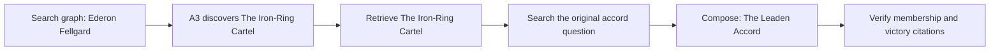

# Live validation — 7 September

These are actual corpus/model runs, not scripted fixtures. The system is not ready
for submission: correctness review and several integration failures remain open.
Reports and one real multi-hop trajectory are preserved under
`tests/reasoning/results/2026-09-07/`.

## Corpus and services

236 documents, 2,487 chunks including 70 described images, 198 entities, 379 relations,
and 2,487 embedded vectors. OpenRouter was verified through LLMClient. Image descriptions
used `minimax/minimax-m3:free`, with zero dead letters. Visual inspection of the Mournwatch
source confirmed 8,254; OCR's 6,254 is an extraction error.

## Diagnostic progression

| Run | Questions | Supported-claim gold-text matches | Partial packets | Interpretation |
|---|---:|---:|---:|---|
| Initial DeepSeek pipeline | 20 | 0 | 20 | Deadlines, token reservations, and provider errors dominated |
| Focused DeepSeek context | 20 | 2 | 18 | Emberdeep and Greyfell succeeded; credit errors persisted |
| Free-model candidate | 20 | 4 | 15 | Some visual and multi-hop success; insufficient reliability |

Gold-text matching is a diagnostic, not a correctness score. A supported claim can be
true without answering the question: the Gauntlet run illustrates this, reporting an
unknown forging date and incorrectly marking the packet complete. A later guard keeps
year questions partial when no year is supplied. Human 0–3 ratings have not been filled
in or inferred from these lexical matches.

## What live traces changed

- Preserve explicit visual/contradiction intent rather than asking A1's optional model
  to reclassify it.
- Keep all raw search hits in telemetry, but focus visual prompts on exact linked source
  subjects. Mere mentions inside another figure's description do not establish identity.
- Pin OpenRouter-shaped model IDs to OpenRouter; they are invalid at other providers.
- Replace successful conservative token reservations with reported usage; retain unknown
  usage reservations after failed calls.
- Accept null as an empty discovery term on completed A3 coverage.
- Fetch citable text after graph discovery instead of spending the loop on graph-only hops.
- Render an unambiguous indexed subject/value line extractively. Reference values and
  competing records cannot take this path. Existing citation and figure validation remain.
- Retain missing information and partial status when an extractive fact does not resolve
  the whole question, including unknown requested units.

## An actual successful multi-hop trajectory

Question 1b_007 asks which accord was won by Ederon Fellgard's faction. The saved run
returned membership and victory claims with excerpts from the character article,
faction article, and Annals. This was observed before the later graph-to-text preference.

## Open gates

P1 readiness and extraction-conflict defects are reproduced in `UPSTREAM-ISSUES.md`.
The formal acceptance preflight remains blocked after search opens embedded Qdrant;
subsequent runs are explicitly labeled diagnostic. Browser automation has no connected
browser. The report, human correctness review, final CI/cross-review, and authentic video
are not complete. Do not present the diagnostic table as final competition performance.

## Latest targeted checks

The numeric/extractive candidate returned supported gold values for five of six figure
questions without partial flags. After allowing exact extractive facts to survive a
partial investigation, the Edge retest returned the cited value 94 with its figure and
retained missing information. Thus all six numeric cases have now returned their gold
values in targeted checks, not in one fresh full-suite run of the final code.

All eight unanswerable requests completed. Seven returned no claims; the canon-conflict
case returned cited background/contradiction claims and listed the absent explanation.
Its incorrect complete flag was fixed and retested as partial. Several other refusals
were caused by deadlines/token budgets, so this is not an 8/8 refusal-accuracy result.
The strict zero-corroborated-claims refusal criterion remains unproven for the background
claims case. No human review CSV has been auto-filled.

The main UI on port 8001 now runs the free model with an explicit process environment
override; `.env` model settings were not overwritten. Restart with
`LLM_MODEL_SYNTHESIS=minimax/minimax-m3:free` to reproduce that model choice.
