# Reasoning layer handoff

The P2 service now implements A1, A2, A3, A5, A6, the bounded orchestrator, mode routing, durable traces, and the UI. A4's deduplication/hop ordering and injection point are implemented; **P1's conflict detector is still absent**. This is not yet a validated competition submission: the real corpus, 203-entity endpoint, model credentials, and upstream conflict implementation were unavailable in this checkout.

## Run against the knowledge service

Keep P1's service on port 8000, then start this separate service:

```sh
KNOWLEDGE_API_URL=http://127.0.0.1:8000 uv run uvicorn src.api.routes.chat:create_app --factory --port 8001
```

Open `http://127.0.0.1:8001/`. This entry point deliberately avoids changing P1's `src/api/main.py`. Configure model credentials and `LLM_MODEL_SYNTHESIS` through the existing settings/environment; all model calls use `LLMClient`. The service uses existing `CACHE_DB`, `TRACE_DB`, `MAX_STEPS`, `MAX_TOKENS_PER_QUERY`, and `MAX_WALL_MS` settings. After a graph or index rebuild, change `KNOWLEDGE_REVISION` to invalidate this HTTP cache namespace without deleting P1's cache. Do not point `KNOWLEDGE_API_URL` back at the chat service.

`POST /v1/chat` accepts the frozen `ChatRequest` and returns the frozen `AnswerPacket`. `POST /v1/chat/jobs` accepts the same body and returns a trace ID immediately. `GET /v1/traces/{id}` supplies live steps, final `packet`, and the separate `verification` report; neither requires changes to the frozen packet. Results persist in SQLite. Background jobs do not resume after process termination; the UI times out explicitly if a job never finishes. Run one process for the small competition demo; the four-job concurrency limit is process-local.

The UI polls the job trace, shows citations with source excerpts, places verified figures inline, renders Markdown tables, displays missing information and warnings, and exports the answer with its trace as JSON. It renders archive/model text with DOM text nodes, never HTML. It does not load third-party scripts. `X-Normalize: false` rolls back name correction on a subsequent self-contained request. Conversation memory is not implemented; nonempty `conversation_id` is explicitly rejected rather than silently ignored. Questions longer than 5,000 characters are rejected at the route.

## P1 integration still needed

1. Implement `GET /v1/graph/entities`, returning a complete `Entity[]` or `{ "entities": Entity[] }`. A1 filters out `Title` records locally. Missing/failed vocabulary leaves names unchanged with `normalization_skipped`; it is not replaced with direct graph/database imports.
2. Connect the conflict detector as `Callable[[list[SearchHit]], list[Conflict]]`. The detector receives original evidence before deduplication, preserving corroboration. For a host application, call `create_app(conflict_detector=adapter)` or override the `get_conflict_detector` FastAPI dependency. The adapter must translate P1's final ABI to the frozen `Conflict` schema. In particular, its resolution is `higher_tier`, not the spec's obsolete `tier_preferred`. Without it, packets carry `conflict_detection_unavailable`, remain partial, and cap confidence at 0.6. We do **not** claim that planted conflict 1a_004 is resolved until this is connected and evaluated.
3. Provide the corpus and upstream API for actual acceptance. `data/corpus/Ashen_Era_Archive/sample_questions.json` is missing, so the 20-question A1 test remains skipped. The 11 question texts in `eval/suites/rich_1a.json` are available and exercised for routing only.
4. The graph seam returns sourced edges but does not include full citation document metadata. A2 keeps those edges and their evidence IDs; later search supplies actual source chunks. It never fabricates documents or chunks from graph edges. The asset metadata seam lacks page dimensions/page count, so A6 checks against returned source pages and drops unverifiable bounding boxes. Global registry/page-bound verification requires an upstream metadata seam; it is not claimed here.
5. `read_section` does not exist. A2 emits a tool failure for it, and A3's prompt excludes it. `list_mentions` is implemented as search on the supplied entity name, as the handbook specifies.

## What is enforced

- Each A2 call executes one action, with shared cache/backoff. Search can degrade to unreranked hybrid and then sparse mode. The default loop is capped at six steps, two steps without new chunks/edges, 60,000 conservatively reserved tokens, and 25 seconds of work waiting time.
- LLM and HTTP waiting are deadline-bound. In-flight calls cannot be forcibly killed: results arriving after the deadline are discarded; guards prohibit subsequent provider calls after cancellation. A timed-out model call may still incur unknown usage, which is explicitly reported in the budget warning. Trace persistence/final rendering occurs after work stops. Token reservation uses UTF-8 prompt bytes plus maximum output tokens for each provider attempt, an intentionally conservative upper bound; it can stop earlier than actual tokenizer accounting would.
- A3 requires quote-backed coverage and a next-query term found in the latest evidence but absent from previously observed evidence and queries. A three-hop fixture proves that later searches use newly discovered entities. Malformed output gets one repair attempt, then **insufficient/partial**, a deliberate safer deviation from the spec's `sufficient:true` failure fallback.
- All evidence, metadata and questions enter model calls inside an escaped, delimited evidence block, with instructions in a separate system message. Instruction-like source spans remain unchanged and carry persisted warnings.
- A5 accepts only source IDs and exact quotes from retrieved chunks. Citation IDs, source metadata and excerpt hashes are code-generated. Figure claims require exact subject matches in the question, claim and excerpt; numeric figure claims also need the subject's label/value pair. A matching reference-bar number is not enough. Tables can render directly from a quoted Markdown table without inventing an image asset.
- A6 checks citation provenance and hashes, figure ownership and marker resolution, then checks entailment. Exact extractive claims have a deterministic path; other claims use the shared LLM. Unsupported claims become explicitly marked inferences; contradicted or untraceable claims disappear from both packet and prose. Missing entailment uses frozen warning type `tool_failure` with action `verification_skipped`, because that action is not itself in frozen `WarningType`. Confidence is recomputed after checks.
- Claims cite distinct documents for corroboration, and exact duplicate excerpts do not count twice. Near-identical evidence is deduplicated by tier, while differing numbers/negations are retained. This is not a substitute for P1's semantic conflict detector or a guarantee of source independence.
- `new_gold_docs` retains the handbook's field name but measures newly encountered document IDs. It is **not** measured gold relevance without gold labels. Cached responses are recorded with zero additional billed cost; original token counts remain available alongside the cache flag.

## Validation and limitations

Run the scoped checks used in `.github/workflows/reasoning.yml`:

```sh
uv run pytest tests/reasoning tests/unit/test_analyst.py tests/unit/test_trace.py tests/unit/test_schemas.py tests/unit/test_retry.py tests/unit/test_cache.py
uv run ruff check src/agents src/synthesis src/api/routes/chat.py src/core/trace.py src/core/usage.py tests/reasoning
uv run black --check src/agents src/synthesis src/api/routes/chat.py src/core/trace.py src/core/usage.py tests/reasoning
uv run mypy src/agents src/synthesis src/api/routes/chat.py src/core/trace.py src/core/usage.py --follow-imports=silent
```

Latest local scoped result: **121 passed, 1 skipped**. The broader `tests/unit tests/reasoning` run: **198 passed, 48 skipped, 2 existing upstream failures**.

The new reasoning fixtures cover all tool variants/failures, a three-step discovery chain, two-empty-step stopping, step/token/wall limits, delayed transports, prompt-boundary attacks, missing P1 detection, table rendering, correct and decoy figure labels, fabricated citations/quotes/markers, entailment outage, durable jobs/traces, and API validation. They use scripted model responses and HTTP fixtures, not a live model or corpus. No answer-accuracy/retrieval eval delta is claimed.

A measured routing delta is available: executing the prior A1 commit (`d247c82`) and this version over the same 11 checked-in rich-question texts with an empty vocabulary yields **6/11 → 11/11 visual routing**. Portrait, banner/emblem and illustration/motif cues account for the improvement. This measures routing, not answer correctness.

The broader unit run still reproduces these two failures in untouched upstream code:

- `test_chunk_provenance.py::test_every_chunk_lists_a_block_for_all_its_text`
- `test_chunker.py::test_a_single_long_block_is_split_at_sentence_boundaries`

For an explicitly labeled offline fixture service:

```sh
uv run uvicorn tests.reasoning.demo_app:create_app --factory --port 8001
npx --yes newman@6.2.1 run tests/postman/Reasoning.postman_collection.json --env-var base_url=http://127.0.0.1:8001
```

That page says TEST FIXTURE, uses scripted answers and a one-pixel placeholder, and must never be represented as a real competition demo. The fixture API and served HTML were checked locally, and UI JavaScript passed `node --check`. Browser discovery returned no available browser, so visual/interactivity QA is pending. Local Newman installation was blocked by `UNABLE_TO_VERIFY_LEAF_SIGNATURE` even with system trust enabled; TLS verification was not disabled. CI includes the Newman collection, but a green remote run is not assumed.

The report, real-corpus eval table, authentic multi-hop trace diagram, and competition video need actual data/model runs. They are not fabricated from these fixtures. The original handbook's submission time also differs from `CLAUDE.md`; confirm the real deadline independently.

```mermaid
flowchart LR
  Q[Question] --> A1[Normalize and plan]
  A1 --> R[Choose entry tool]
  R --> A2[One HTTP retrieval action]
  A2 --> A3[Quote-backed coverage and next discovery]
  A3 -->|missing and within budget| A2
  A3 -->|covered or stopped| A4[Deduplicate and P1 conflict hook]
  A4 --> A5[Claims and selected figures]
  A5 --> A6[Provenance and entailment checks]
  A6 --> P[Frozen answer packet]
  P --> UI[UI and persistent trace]
```


