# Reasoning layer handoff

The P2 service implements A1–A6, the bounded orchestrator, mode routing, durable traces, and the UI. Current measured results and remaining gates are in [LIVE-VALIDATION.md](LIVE-VALIDATION.md); P1 integration defects are in [UPSTREAM-ISSUES.md](UPSTREAM-ISSUES.md). P1's vocabulary endpoint and conflict detector are now integrated through their actual contracts. This is not yet a validated competition submission: the raw corpus has now been located outside the checkout; local knowledge indexing and real answer validation are still pending.

## Run against the knowledge service

Keep P1's service on port 8000, then start this separate service:

```sh
KNOWLEDGE_API_URL=http://127.0.0.1:8000 uv run uvicorn src.api.routes.chat:create_app --factory --port 8001
```

Open `http://127.0.0.1:8001/`. This entry point deliberately avoids changing P1's `src/api/main.py`. Configure model credentials and `LLM_MODEL_SYNTHESIS` through the existing settings/environment; all model calls use `LLMClient`. The service uses existing `CACHE_DB`, `TRACE_DB`, `MAX_STEPS`, `MAX_TOKENS_PER_QUERY`, and `MAX_WALL_MS` settings. After a graph or index rebuild, change `KNOWLEDGE_REVISION` to invalidate this HTTP cache namespace without deleting P1's cache. Do not point `KNOWLEDGE_API_URL` back at the chat service.

`POST /v1/chat` accepts the frozen `ChatRequest` and returns the frozen `AnswerPacket`. `POST /v1/chat/jobs` accepts the same body and returns a trace ID immediately. `GET /v1/traces/{id}` supplies live steps, final `packet`, and the separate `verification` report; neither requires changes to the frozen packet. Results persist in SQLite. Background jobs do not resume after process termination; the UI times out explicitly if a job never finishes. Run one process for the small competition demo; the four-job concurrency limit is process-local.

The UI polls the job trace, shows citations with source excerpts, places verified figures inline, renders Markdown tables, displays missing information and warnings, and exports the answer with its trace as JSON. It renders archive/model text with DOM text nodes, never HTML. It does not load third-party scripts. `X-Normalize: false` rolls back name correction on a subsequent self-contained request. Conversation memory is not implemented; nonempty `conversation_id` is explicitly rejected rather than silently ignored. Questions longer than 5,000 characters are rejected at the route.

## P1 integration and remaining dependencies

1. A1 and A4 share one validated `EntityVocabularyResponse` from `GET /v1/graph/entities?limit=1000`. The service rejects truncated or empty named-entity vocabularies and filters out `Title` records. Failed vocabulary leaves names unchanged with `normalization_skipped`.
2. `ConflictAdapter` translates original `SearchHit` evidence into frozen `Chunk` objects and calls P1's `detect_conflicts(chunks, typed_entities)`. A4 preserves its conflicts and reliability notes. The default chat factory installs this adapter automatically; a custom detector remains injectable. Fixture tests cover founding/forging discrepancies and numeric versus missing attunement values. Actual planted conflict 1a_004 still requires live corpus evaluation.
3. All 20 dev-question texts are now available in P1's checked-in gold suites and pass an A1 smoke test. The original raw `sample_questions.json` acceptance test now passes when `ASHEN_SAMPLE_QUESTIONS` points to the supplied file. Unicode punctuation links to canonical entities without changing the user's text; both 1C questions route to contradiction.
4. The graph seam returns sourced edges but does not include full citation document metadata. A2 keeps those edges and their evidence IDs; later search supplies actual source chunks. It never fabricates documents or chunks from graph edges. The asset metadata seam lacks page dimensions/page count, so A6 checks against returned source pages and drops unverifiable bounding boxes. Global registry/page-bound verification requires an upstream metadata seam; it is not claimed here.
5. `read_section` does not exist. A2 emits a tool failure for it, and A3's prompt excludes it. `list_mentions` is implemented as search on the supplied entity name, as the handbook specifies.

## What is enforced

- Each A2 call executes one action, with shared cache/backoff. Search can degrade to unreranked hybrid and then sparse mode. Standard UI searches request six steps; the opt-in Deep Semantic Search requests up to the 12-step server ceiling while preserving the selected approach. Both stop after two steps without new chunks/edges and share the 200,000-token / 90-second safeguards.
- LLM and HTTP waiting are deadline-bound. In-flight calls cannot be forcibly killed: results arriving after the deadline are discarded; guards prohibit subsequent provider calls after cancellation. A timed-out model call may still incur unknown usage, which is explicitly reported in the budget warning. Trace persistence/final rendering occurs after work stops. Token reservation uses UTF-8 prompt bytes plus maximum output tokens for each provider attempt, an intentionally conservative upper bound; it can stop earlier than actual tokenizer accounting would.
- A3 requires quote-backed coverage and a next-query term found in the latest evidence but absent from previously observed evidence and queries. A three-hop fixture proves that later searches use newly discovered entities. Malformed output gets one repair attempt, then **insufficient/partial**, a deliberate safer deviation from the spec's `sufficient:true` failure fallback.
- All evidence, metadata and questions enter model calls inside an escaped, delimited evidence block, with instructions in a separate system message. Instruction-like source spans remain unchanged and carry persisted warnings.
- A5 accepts only source IDs and exact quotes from retrieved chunks. Citation IDs, source metadata and excerpt hashes are code-generated. Figure claims require exact subject matches in the question, claim and excerpt; numeric figure claims also need the subject's label/value pair. A matching reference-bar number is not enough. Tables can render directly from a quoted Markdown table without inventing an image asset.
- A6 checks citation provenance and hashes, figure ownership and marker resolution, then checks entailment. Exact extractive claims have a deterministic path; other claims use the shared LLM. Unsupported claims become explicitly marked inferences; contradicted or untraceable claims disappear from both packet and prose. Missing entailment uses frozen warning type `tool_failure` with action `verification_skipped`, because that action is not itself in frozen `WarningType`. Confidence is recomputed after checks.
- Claims cite distinct documents for corroboration, and exact duplicate excerpts do not count twice. Near-identical evidence is deduplicated by tier, while differing numbers/negations are retained. This is not a substitute for P1's semantic conflict detector or a guarantee of source independence.
- `new_gold_docs` retains the handbook's field name but measures newly encountered document IDs. It is **not** measured gold relevance without gold labels. Cached responses are recorded with zero additional billed cost; original token counts remain available alongside the cache flag.

## Validation and limitations

Run the scoped checks used in `.github/workflows/reasoning.yml`:

```sh
uv run pytest tests/reasoning tests/unit/test_analyst.py tests/unit/test_trace.py tests/unit/test_schemas.py tests/unit/test_retry.py tests/unit/test_cache.py
uv run ruff check src/agents src/synthesis src/api/routes/chat.py src/core/trace.py src/core/usage.py tests/reasoning
uv run black --check src/agents src/synthesis src/api/routes/chat.py src/core/trace.py src/core/usage.py tests/reasoning
uv run mypy src/agents src/synthesis src/api/routes/chat.py src/core/trace.py src/core/usage.py --follow-imports=silent
```

Latest local scoped result, including P1 conflict tests: **159 passed, 7 skipped**. Lint, formatting, and reasoning type checks pass. The earlier broader `tests/unit tests/reasoning` run: **198 passed, 48 skipped, 2 existing upstream failures**.

The new reasoning fixtures cover all tool variants/failures, a three-step discovery chain, two-empty-step stopping, step/token/wall limits, delayed transports, prompt-boundary attacks, missing P1 detection, table rendering, correct and decoy figure labels, fabricated citations/quotes/markers, entailment outage, durable jobs/traces, and API validation. They use scripted model responses and HTTP fixtures, not a live model or corpus. No answer-accuracy/retrieval eval delta is claimed.

A measured routing delta is available: executing the prior A1 commit (`d247c82`) and this version over the same 11 checked-in rich-question texts with an empty vocabulary yields **6/11 → 11/11 visual routing**. Portrait, banner/emblem and illustration/motif cues account for the improvement. This measures routing, not answer correctness.

The broader unit run still reproduces these two failures in untouched upstream code:

- `test_chunk_provenance.py::test_every_chunk_lists_a_block_for_all_its_text`
- `test_chunker.py::test_a_single_long_block_is_split_at_sentence_boundaries`

For an explicitly labeled offline fixture service:

```sh
uv run uvicorn tests.reasoning.demo_app:create_app --factory --port 8001
npx --yes newman@6.2.1 run tests/postman/Reasoning.postman_collection.json --env-var base_url=http://127.0.0.1:8001
```

That page says TEST FIXTURE, uses scripted answers and a one-pixel placeholder, and must never be represented as a real competition demo. The fixture API and served HTML were checked locally, and UI JavaScript passed `node --check`. Browser discovery returned no available browser, so visual/interactivity QA is pending. Local Newman installation was blocked by `UNABLE_TO_VERIFY_LEAF_SIGNATURE` even with system trust enabled; TLS verification was not disabled. The hosted CI run for code commit `537e2e2` subsequently passed lint/type checks, the scoped test suite, and the Newman collection ([run 34039321239](https://github.com/da4ngel/Doomed/actions/runs/34039321239)). This validates the scripted API contracts, not real-corpus answer accuracy.

The report, real-corpus eval table, authentic multi-hop trace diagram, and competition video need actual data/model runs. They are not fabricated from these fixtures. The original handbook's submission time also differs from `CLAUDE.md`; confirm the real deadline independently.

```mermaid
flowchart LR
  Q[Question] --> A1[Normalize and plan]
  A1 --> R[Choose entry tool]
  R --> A2[One HTTP retrieval action]
  A2 --> A3[Quote-backed coverage and next discovery]
  A3 -->|missing and within budget| A2
  A3 -->|covered or stopped| A4[Deduplicate and P1 conflict detector]
  A4 --> A5[Claims and selected figures]
  A5 --> A6[Provenance and entailment checks]
  A6 --> P[Frozen answer packet]
  P --> UI[UI and persistent trace]
```



## Live acceptance runner

```sh
uv run python -m tests.reasoning.acceptance --preflight-only
uv run python -m tests.reasoning.acceptance --suite dev
uv run python -m tests.reasoning.acceptance --suite unanswerable
```

Use `--knowledge-url`, `--chat-url`, and `--out` for remote services and output location. The runner checks index readiness, a complete vocabulary, and a real chat endpoint before submitting questions. It rejects the scripted fixture. Each run writes JSON/Markdown reports and a blank human-review CSV; completed questions also save answer packets and traces. Gold answers never enter chat requests. Lexical matches are diagnostic only and exclude conflict prose; correctness, negation, subject binding, and refusal quality require human review. The trace endpoint now includes `retrieval_evidence`: ordered A2 actions, observed chunk/document identities, and sourced graph edges. This is persisted separately from the frozen packet. The runner computes cumulative gold-document recall, complete gold-document coverage, and new gold documents per retrieval step from these observed hits. Repeated chunks/documents do not increase gain. Graph-only chunk references are preserved for review but do not count as retrieved source documents until a search supplies their document IDs. These are cumulative trajectory metrics, not recall@k for one ranked search. Old traces without this telemetry report metrics unavailable, and suites without gold labels return null rather than zero. Gold IDs must match the service's document IDs exactly; no fuzzy mapping is performed.

The 6 September integration preflight returned `blocked`, with zero questions attempted: both localhost services refused connections. This is an infrastructure result, not a zero answer-accuracy score. Start the corpus-backed knowledge service and configured chat service before running the full suites. Browser interaction checks, real metrics, cross-review, and submission artifacts remain pending.

Human review can now be summarized with `python -m tests.reasoning.review_report RUN_DIRECTORY` after filling in `human-review.csv`. Blank judgments remain unreviewed; failed requests cannot become scored successes, and blocked/empty runs cannot become completed reviews. `review_complete` describes review coverage, not answer acceptance. See [DELIVERY-CHECKLIST.md](DELIVERY-CHECKLIST.md) for the real-corpus demonstration and submission sequence.

CI follow-up: the hosted deadline test previously raced a 20 ms setup window; it now advances an injected clock after the first failed transport call. Hosted cache cleanup also timed out on a lock held by the long-running `uv run` fixture. CI now starts the installed uvicorn executable directly and stops the fixture before cache cleanup. Both fixes passed hosted CI, including Newman and cache cleanup: [run 34052033186](https://github.com/da4ngel/Doomed/actions/runs/34052033186).

To test A1 against an archive outside the checkout without copying it:

```sh
ASHEN_SAMPLE_QUESTIONS='/path/to/Ashen_Era_Archive/sample_questions.json' uv run pytest tests/unit/test_analyst.py
```

The supplied original question file passed all 27 A1 tests. Its 20 IDs match the checked-in suites; `1a_001` differs only in a curly versus straight apostrophe. This verifies query handling, not real entity-endpoint or answer accuracy.

## Local corpus setup observation (7 September)

The supplied archive is linked read-only by convention at the expected `data/corpus/Ashen_Era_Archive` path. P1's existing ingestion and graph commands produced 236 documents, 3,134 blocks, 2,747 text chunks, 198 entities and 379 relations, with zero ingestion dead letters. These counts differ from the handbook; this build has no VLM figure chunks yet. BM25 is built. All 167 scoped tests, including the previously skipped real sample/conflict tests, passed against this local text index. This does not establish model answer accuracy or visual acceptance. Full acceptance now blocks when the knowledge API reports zero image descriptions, even if its general readiness status is `ready`.

The locally detected provider is Bedrock while configured synthesis/vision IDs name OpenRouter models. Resolve provider/model configuration before image description and answer evaluation. Do not treat credential-file presence as verified model access.

Dense indexing completed: 2,747 vectors in 784 seconds. The knowledge API starts warm on port 8000, and the chat UI is served on port 8001. A live HTTP smoke test handled all 20 original questions against the actual 198-entity vocabulary unchanged; hybrid retrieval returned Gloamreach wiki/codex hits. These are real HTTP checks without synthesis calls. Acceptance remains blocked by zero image descriptions. P1's current `VISION_LADDER` supports OpenRouter and OpenAI only; Bedrock credentials alone cannot run the image CLI. Configure an existing supported provider locally, then restart services, describe images, rebuild chunks/index while the embedded-store API is stopped, and run full acceptance.

## First live model checks

OpenRouter synthesis access is verified through `LLMClient`. The image pipeline described all 70 unique images with no dead letters (15 records have numeric values); the records preserve Emberdeep 1,114, Greyfell 3,695, Edge 94 and Lantern 55 under their subject labels. Rechunking with tokenizer resources available produced 2,487 chunks, including all 70 figures; the vector rebuild is in progress. Earlier 2,747-chunk counts describe the text-only build and must not be used as current counts.

The first live Gloamreach question retrieved the gold document but exhausted the 25-second budget during cold retrieval/model work. A second run hit the conservative token budget. Neither returned a supported claim; these are failures, not correct answers. Trace inspection motivated two changes: explicit visual/contradiction intent no longer gets overwritten by A1's optional LLM, and A3's latest evidence references existing chunk IDs instead of duplicating their text. All 170 scoped tests pass with no skips. Live answer validation of these fixes remains pending the full index rebuild.

Current local model runs are no longer blocked on a missing key or archive. The full figure index is built, and targeted numeric answers work. Full acceptance is still incomplete: see the live validation report rather than the historical setup observations above. Successful provider calls now reconcile conservative reservations to reported usage; failed/unreported calls retain their reservations.
